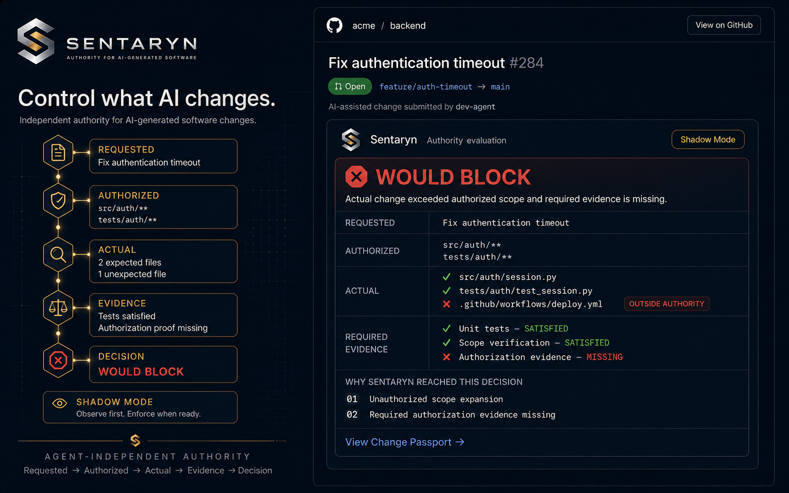
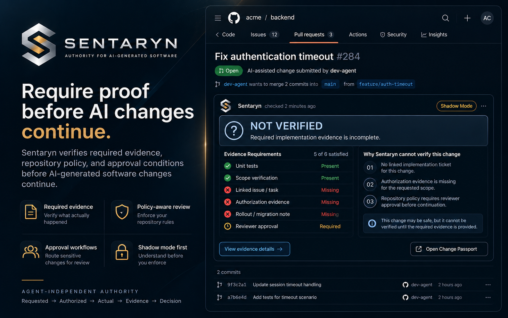
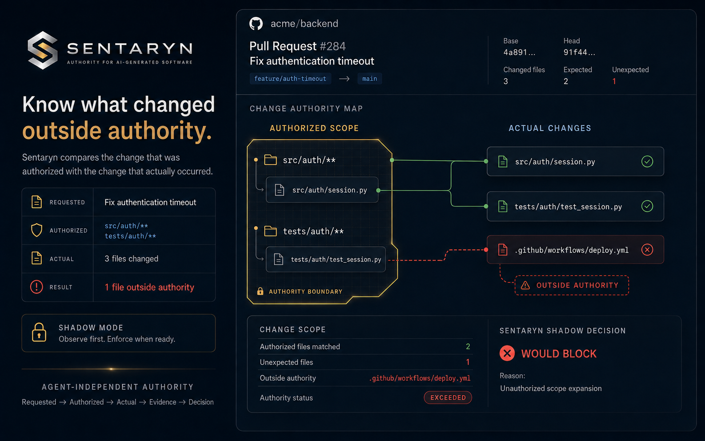
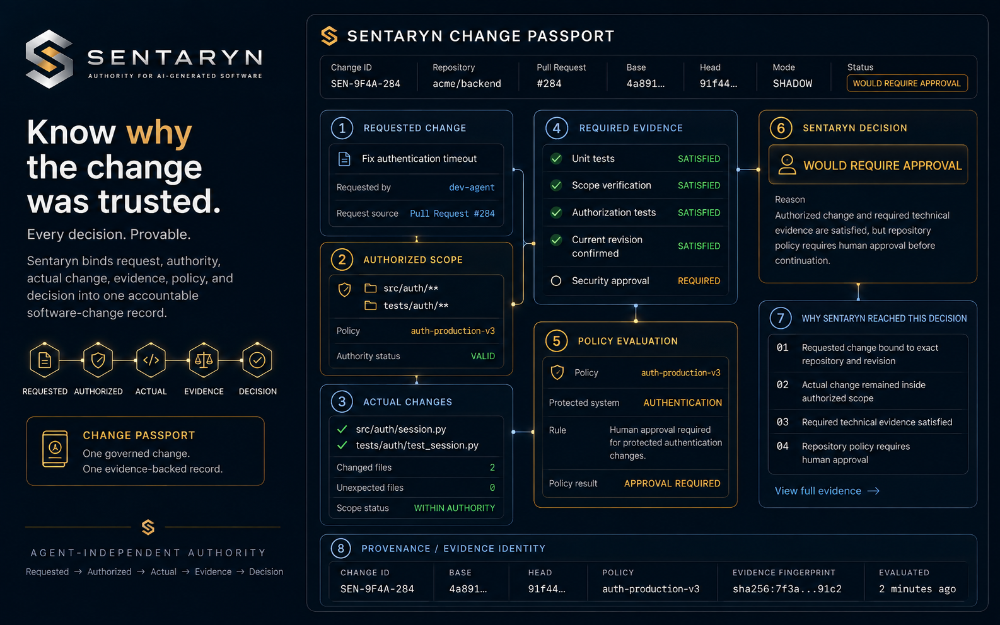

# SENTARYN

## Authority for AI-generated software changes.

**Control what AI changes in your software.**

SENTARYN is an independent authority layer that evaluates whether an AI-generated software change stayed within the authority it was given—not only whether the change works.

> **Requested → Authorized → Actual → Evidence → Decision**

[Website](https://sentaryn.com) · [Install the GitHub App](https://github.com/apps/sentaryn/installations/new) · [Architecture](docs/architecture.md) · [Authority model](docs/authority-model.md)

---

## What is SENTARYN?

AI coding agents can propose increasingly capable changes across source code, tests, configuration, infrastructure, and delivery workflows. SENTARYN provides a separate authority boundary for those changes.

For each change, SENTARYN compares the original request, the scope that was authorized, the files and behavior actually changed, the available evidence, and the applicable policy. It then produces an explicit decision that can be surfaced as a GitHub Check and recorded in a Change Passport.

SENTARYN is designed to answer a narrow but essential question:

> **Was this change authorized?**

<p align="center">
  
</p>

SENTARYN evaluates the requested change, authorized scope, actual change, evidence, and policy before producing an authority decision. All screenshots below are public product demonstrations.

## Access is not Authority

An agent may have technical access to a repository without having authority to change every file it can reach.

Repository permissions describe capability: what an identity or tool is able to do. Authority describes the approved boundary for a specific change: what it is allowed to do in this context.

```text
Can modify repository ≠ Authorized to modify every path
Can open a pull request ≠ Authorized scope was respected
Tests passed ≠ Change was authorized
```

This separation allows teams to use capable AI systems without treating broad technical access as unlimited approval.

## Core authority model

SENTARYN evaluates five connected elements:

| Element | Question |
| --- | --- |
| **Requested** | What outcome was asked for? |
| **Authorized** | What scope and actions were approved? |
| **Actual** | What did the change really modify? |
| **Evidence** | What verifiable signals support the evaluation? |
| **Decision** | Does policy permit the observed change? |

The model is intentionally independent from the agent that generated the code. See the [authority model](docs/authority-model.md) for the underlying distinctions.

## Decision outcomes

SENTARYN expresses authority decisions in a small, explicit vocabulary:

- **ALLOW** — the change is within authorized scope and satisfies the required evidence and policy conditions.
- **REQUIRE APPROVAL** — the change needs a designated human approval before it can proceed.
- **BLOCK** — the change violates an authority or policy boundary.
- **NOT VERIFIED** — the available evidence is insufficient to establish a reliable authority decision.

These outcomes communicate authority, not a general claim that the code is correct, secure, or defect-free.

## Shadow Mode

Shadow Mode evaluates real changes without blocking them. It reports what SENTARYN **would** decide—**WOULD ALLOW**, **WOULD REQUIRE APPROVAL**, **WOULD BLOCK**, or **NOT VERIFIED**—while existing delivery workflows remain in control.

<p align="center">
  
</p>

Teams can observe these outcomes, compare them with human review, and tune authority policies before enabling enforcement. Learn more in [Shadow Mode](docs/shadow-mode.md).

## Example scenario

**Request:** Fix authentication timeout

**Authorized:**

```text
src/auth/**
tests/auth/**
```

**Actual:**

```text
src/auth/session.py
tests/auth/test_session.py
.github/workflows/deploy.yml
```

| Signal | Result |
| --- | --- |
| Tests | **PASSED** |
| Authority | **EXCEEDED** |
| Decision | **WOULD BLOCK** |
| Reason | Unauthorized scope expansion |

The authentication changes may be correct and the tests may pass, but the deployment workflow falls outside the authorized paths. Correctness evidence does not grant authority. See the [full scenario](examples/authority-scenario.md).

## Authority Map

The Authority Map makes the boundary of a change visible. It relates the request to authorized and actual scope, then highlights matches, expansions, exclusions, and evidence gaps.

<p align="center">
  
</p>

The map is an explanation surface, not a substitute for the evidence-backed decision record.

## Change Passport

A Change Passport binds request, authority, actual change, evidence, revision identity, policy, and decision into one inspectable record.

<p align="center">
  
</p>

The record is designed to make the basis of a decision inspectable and portable across review and delivery workflows. Read the [Change Passport overview](docs/change-passport.md).

## Authority is a distinct control

| Control | What it answers | What it does not prove |
| --- | --- | --- |
| **Correctness** | Does the change behave as expected? | That the change was authorized |
| **Code review** | Did a reviewer assess the proposed change? | That actual scope matches delegated authority |
| **Identity** | Who or what acted? | What that actor was allowed to change |
| **Repository access** | Can the actor perform an operation? | Whether this specific operation is authorized |
| **Authority** | Did the actual change remain within its approved boundary? | That the implementation is otherwise correct |

These controls reinforce one another, but they are not interchangeable.

## Agent-independent design

SENTARYN evaluates the resulting software change rather than depending on a single generation environment. The authority model can sit across workflows involving:

- Claude Code
- Codex
- Cursor
- GitHub Copilot
- Internal agents

Agent independence keeps the control boundary separate from the tool being governed.

## Repository guide

| Path | Purpose |
| --- | --- |
| [docs/architecture.md](docs/architecture.md) | Safe public architecture and evaluation flow |
| [docs/authority-model.md](docs/authority-model.md) | Core authority concepts and distinctions |
| [docs/change-passport.md](docs/change-passport.md) | Evidence-backed change record |
| [docs/shadow-mode.md](docs/shadow-mode.md) | Non-blocking evaluation before enforcement |
| [examples/authority-scenario.md](examples/authority-scenario.md) | Worked authentication-timeout scenario |
| [assets/README.md](assets/README.md) | Guidance for public product imagery |

## Public showcase scope

This repository is a public product and architecture showcase. It intentionally does not contain proprietary Governor or SENTARYN source code, production topology, private policy schemas, secrets, credentials, customer data, internal deployment details, or private implementation internals.

The documents describe product concepts and safe architectural boundaries. They do not make claims about customers, certifications, compliance, revenue, adoption, or production usage.

## Links

- **Website:** [sentaryn.com](https://sentaryn.com)
- **GitHub App:** [Install SENTARYN](https://github.com/apps/sentaryn/installations/new)
- **Founder:** [DonUserOn on GitHub](https://github.com/DonUserOn)
- **LinkedIn:** [Ossama Hanan](https://www.linkedin.com/in/ossamahanan/)

---

**Let AI build. Keep control.**
