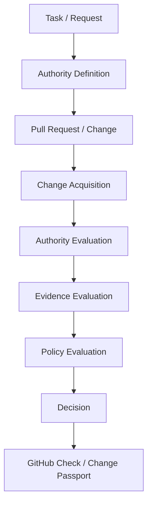

# Public Architecture Overview

SENTARYN is an independent authority layer for AI-generated software changes. The public architecture describes the evaluation flow and trust boundaries without exposing proprietary implementation details.

## Evaluation flow

### 1. Task / Request

The workflow begins with the intended outcome: the task an AI agent or engineering process is asked to complete.

### 2. Authority Definition

The request is paired with an explicit authority boundary. This can identify the approved scope and the evidence or approvals required for the change.

### 3. Pull Request / Change

An agent-independent software change is proposed through a reviewable repository workflow.

### 4. Change Acquisition

The evaluation obtains the relevant repository and revision context needed to identify the actual change. The public model treats acquisition as an evidence boundary: the decision must relate to the specific change being reviewed.

### 5. Authority Evaluation

Observed changes are compared with the defined authority. Scope that extends beyond the approved boundary is made explicit.

### 6. Evidence Evaluation

Available signals are checked for relevance and connection to the evaluated change. Missing evidence is not treated as passing evidence.

### 7. Policy Evaluation

Applicable policy relates authority findings, evidence, and approval requirements to a decision. This layer remains independent from the agent that authored the change.

### 8. Decision

The evaluation produces **ALLOW**, **REQUIRE APPROVAL**, **BLOCK**, or **NOT VERIFIED**. In Shadow Mode, enforceable outcomes are expressed as what the system would decide.

### 9. GitHub Check / Change Passport

The decision can be surfaced where engineers review changes and recorded in a Change Passport that binds the decision to its inputs and evidence.

## Deliberate public boundary

Production topology, private schemas, secrets, customer data, internal policy implementation, and proprietary Governor internals are intentionally omitted from this public repository. Credentials and private deployment details are omitted as well.

This overview communicates product boundaries and the logical evaluation sequence. It is not an operational diagram and should not be read as documentation of private infrastructure or implementation.

## Related documents

- [Authority model](authority-model.md)
- [Change Passport](change-passport.md)
- [Shadow Mode](shadow-mode.md)
- [Worked authority scenario](../examples/authority-scenario.md)
- [Repository overview](../README.md)
