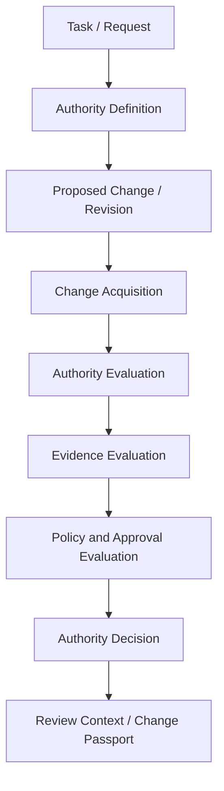

# Public Architecture Overview

SENTARYN’s authority model evaluates whether an AI-generated software change satisfies the authority granted for its task. This public architecture describes the logical evaluation flow and conceptual trust boundaries.

## Evaluation flow

### 1. Task / Request

The flow begins with the intended outcome: the task an AI agent or engineering process is asked to complete. A request establishes purpose; it does not automatically authorize every repository change.

### 2. Authority Definition

The request is paired with an explicit authority boundary: approved scope and actions, required evidence, and approval conditions.

### 3. Proposed Change / Revision

A software change is proposed through a reviewable repository workflow. The authority model is independent from the agent that generated it.

### 4. Change Acquisition

The evaluation identifies the actual change between defined base and head revisions. This is an evidence boundary: changed-file data and other signals must refer to the specific repository and revision being reviewed.

### 5. Authority Evaluation

Actual scope is compared with authorized scope. Changes beyond the approved boundary are explicit scope expansion, even when the changed code passes tests.

### 6. Evidence Evaluation

Available signals are evaluated for relevance and connection to the exact change. Missing evidence is not passing evidence, and evidence from another revision does not establish the state of this one.

### 7. Policy and Approval Evaluation

Applicable policy connects authority findings, required evidence, and approval conditions to a decision. Being within authorized paths does not by itself satisfy every approval requirement.

### 8. Authority Decision

The model produces **ALLOW**, **REQUIRE APPROVAL**, **BLOCK**, or **NOT VERIFIED**. Shadow Mode expresses the first three as **WOULD ALLOW**, **WOULD REQUIRE APPROVAL**, and **WOULD BLOCK**, without gating the change.

### 9. Review Context / Change Passport

The decision is explained through its request, authorized boundary, observed revision, evidence, policy, and approvals. A Change Passport connects that context into one inspectable record for the software change.

## Conceptual trust boundaries

- **Intent and authorization:** a task description is not an unlimited grant of authority.
- **Authorization and observation:** actual scope comes from the change, rather than the agent’s account of what it changed.
- **Evidence and decision:** passing tests support behavior claims; they do not grant permission for additional scope.
- **Revision and provenance:** evidence and approvals need context tying them to the evaluated change.
- **Observation and enforcement:** a Shadow Mode outcome describes a decision without becoming a merge gate.

This is a logical product model, not a deployment diagram. Private implementation, policy schemas, storage design, credentials, customer data, deployment topology, and proprietary Governor internals are outside this overview.

## Related documents

- [Authority model](authority-model.md)
- [Change Passport](change-passport.md)
- [Shadow Mode](shadow-mode.md)
- [Worked authority scenario](../examples/authority-scenario.md)
- [Repository overview](../README.md)
